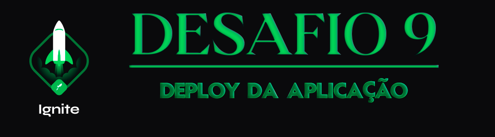

<div align="center">
  
</div>

<h1 align="center"> RocketSeat 🚀 Ignite ReactJS 🔥</h1>

<p align="center">
  <a href="https://rocketseat.com.br">
    
  </a>
  
  
  
</p>

## 🧠 Detalhes do desafio

Nesse desafio, você deverá fazer o deploy de uma das aplicações mais legais que vimos em toda a trilha do Ignite, o Ignews. 

Esse desafio tem o objetivo que você pratique o tópico de publicação de aplicações Web com uma aplicação real.

## ⚙️ Instalação do projeto

## Clone este repositório e acesse o diretório

```sh
$ git clone git@github.com:augustohermes/desafio-09-deploy-do-ignews.git && cd desafio-09-deploy-do-ignews
```

## Crie um arquivo `.env.local` e coloque as variáveis de ambiente baseando-se no arquivo `.env.example` que se encontra na pasta do projeto.

## Instale as dependências necessárias

```sh
$ yarn
```

## Rodando o projeto

Após o correto preenchimento do `.env.local` execute o seguinte comando para rodar a aplicação:

```sh
$ yarn dev
```

## A aplicação irá rodar em http://localhost:3000

<br>

Feito com ❤️ por [Augusto Hermes](https://github.com/augustohermes) 👋.
